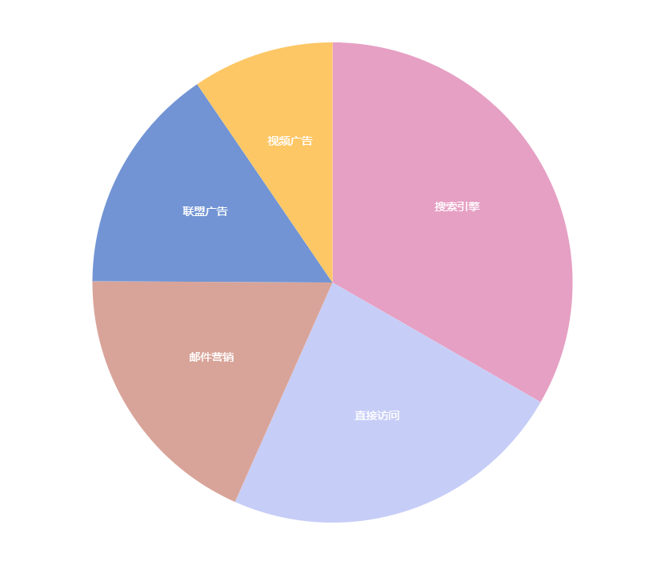
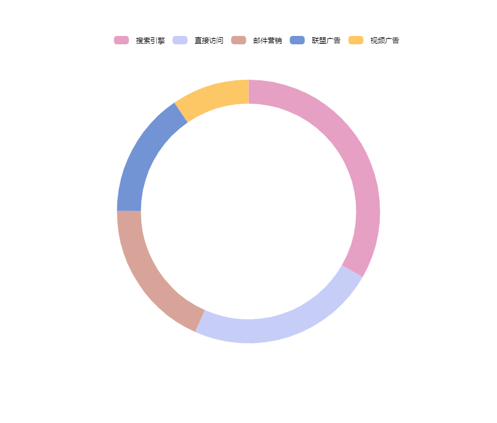

# draw-charts-with-canvas

HTML5中可以通过Canvas标签获取getContext("2d") 对象,它提供了很多绘制的属性和方法，可用于在画布上绘制文本、线条、矩形、圆形等等。

运行 node server.js, 打开demo文件夹下的文件可查看效果。

## 示例
折线图

平滑折线图

多条折线图

基础面积图

多系列面积图

柱状图

雷达图

饼状图

圆环图
